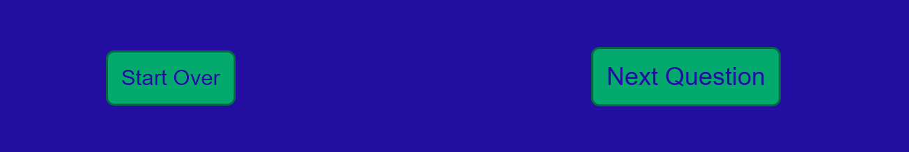

# Quiz - Project 2

This is a browser-based quiz game constructed using JavaScript, CSS3 and HTML5. It allows the user to answer 10 randomly selected questions and get their score at the end of the quiz, and get a report on which questions they answered incorrectly. This quiz game can be played by everyone

The main aim of this project is to construct a visually appealing, responsive and accessible browser game that ticks all the boxes of a modern user experience, and display how such an application can be constructed using JavaScript.

[Live link to website](https://sofski93.github.io/Project2/index.html)

# Features

## The Intro Page

This is the landing page that first appears when the user loads the website. Some introductory text appears and also a text box underneath that allows the user to enter a username to continue the game, as a personal touch to keep the user engaged. Some form validation is added here to ensure that the user enters a username.
The username is saved in the web browser using JavaScript local storage, so it can be retrieved later by the next page.

Clicking on the Start Quiz button will load the main game page which follows at game.html

## The Game Page
This is the main page of the game that holds all relevant HTML structure and linked JavaScript code that operates the game functionality. The page is composed of the following elements:

### The Header
This appears at the top of the page and has the game name and logo on the left, and on the right the user's entered username appears, welcoming them to the game.

### The Game Panel
This panel displays the questions for the quiz and what number that question is out of the total of 10. The 4 possible answers are displayed as buttons underneath, and as shown in the below image, clicking on a button displays the correct answer in green and all other answers in red. After answering, all buttons will be disabled so that the user can't re-answer the question, but the "Next Question" button remains to allow the user to continue.

### Game Controls
This section holds the 2 game control buttons, a button to restart the game and one to continue onto the next question. The user continues looping through the questions in this format, until the 10th question. After the final question has been answered, the "Next Question" button changes to a "Get Result" button and clicking on this forwards the user to a "Quiz Report" pop-up window.

## The Quiz Result Popup Window
This window shows the final score achieved, and a breakdown of the correct and incorrect answers. The user has the option of clicking the "Play Again" button to try another quiz.

# Technologies Used
The following is a list of the various technologies employed to build this project
+ HTML5 - Hypertext markup language used to give the website its overall structure and semantic value.
+ CSS3 - Cascading Style Sheets used to apply consistent styles across all sections of the application.
+ Google Fonts - Font is embedded into the website by way of importing the correct google font link into the linked CSS file.
+ Font Awesome - Fontawesome toolkit imported into HTML files and its icons used to show button icons and logo.
+ Git, Github & Gitpod - Used to continuously develop and deploy the incremental versions of the application.
+ Balsamiq Wireframes - Downloadable software to create the wireframe mockups.
+ GIMP - GNU Image Manipulation Program, used to resize, crop & optimise the image content for embedding on this document.
+ Local Storage - A JavaScript utility that allows key-value pairs of data to be stored for later use in a web browser.
+ OpenTrivia Database - A web API supplying quiz questions in JSON format.

# Testing

## Cross-Browser Testing
The application was functionally tested across the 3 web browsers, Google Chrome, Microsoft Edge & Mozilla Firefox. The site loaded consistently across all 3 and no issues were detected on any browser.

## Responsiveness Testing
During development of this application, I regularly tested the responsiveness of the site using Google Chrome's Developer tools. In my CSS media query rules, I used 2 separate breakpoints to design the site for different screen sizes.
+ 800px width and below (medium screen size)
+ 600px width and below (small screen size)

### The Intro Page
The intro page was laid out using full width divs and containers, so the app displays identically across all screen sizes, the only difference being the paddings adjusted and also the label and input box stack on top of each other.

### Game Page - Header
The header section of the game page changes from a 2 column layout to 1 column on smaller screens, the name and logo stacking on top of the welcome username text.

### Game Page - Question Panel
The game panel section changes from a 4 column layout to just 1 column on the smaller screen sizes, the question boxes stacking on top of each other, with some necessary padding/margin/font-size adjustments to suit the viewport.

### Game Page - Game Controls
Similar to the previous sections the game controls change from multiple columns to a one column layout on smaller devices. Also, the order of the buttons are reversed, to give a better user experience it was decided that the "Next Question" button should appear above the "Restart" option.

### The Quiz Result Popup Window
The modal window appears identically to the large screen versions, with the results in a table format. Some scrolling had to be undertaken to see all results and access the "New Game" button, but this was unavoidable due to the amount of information needed to be displayed on the modal.

## User Testing
The quiz app website was tested by another person and they found it a pleasant user experience, reporting no usability issues and found it an easy user journey through the game. They reported the question buttons being clearly available to click when they wanted to answer, and quickly found the "Get Result" button when the 10th question was answered.

### Button Enabling/Disabling
In order to effectively control the game functions, certain buttons have to be enabled or disabled depending on user interaction. When a question has been loaded, the "next question" button is disabled until the user has clicked an answer. When an answer is clicked the "next question" button is re-enabled, but the question buttons are disabled to disallow the user from having a second chance to answer the question. This process is repeated for all 10 questions.

## Validator Testing
The HTML of the website was tested using the validator at https://validator.w3.org/. No errors were reported.

The CSS was tested using the validator at https://jigsaw.w3.org/css-validator/ and no errors were reported.

## Performance Testing
I tested the game's web page performance using Lighthouse in Google Chrome Developer Tools. I was pleased with the results which ranged from 92 to 100. Results are seen below:

## Errors, Bugs or Issues During Development

# Deployment

## The steps undertaken to deploy this website to Github Pages is as follows:

1. I accessed the Code Institute template at [https://github.com/Code-Institute-Org/gitpod-full-template] and clicked on the "Use This Template" button.
2. The next step was to give my repository a suitable name on Github, and create it thereafter.
3. On the following page I clicked on the green Gitpod button, which is accessible having installed the Gitpod extension to Google Chrome browser.
4. This created my development environment on Gitpod where I began to push the incremental changes to the live hosted site.
5. To create the hosted site at Github Pages, I navigated to the Github repo settings tab and found the Github pages dedicated section.
6. From there in the Source dropdown menu I clicked on "main", and then "Save", from which I was supplied a live link that would be ready in a few minutes. Live link is available here [https://kevinjohnkiely.github.io/quick-quiz-project-2/]

# Credits

## Code

+ The code for the modal popup window came from W3CSchools website tutorial, with modifications to suit my application. The tutorial is linked here [https://www.w3schools.com/howto/howto_css_modals.asp]
+ The code to import the questions by way of an API call came from the OpenTrivia Database API website, with the selected parameters available to modify at this link: [https://opentdb.com/api_config.php]

All other HTML, CSS and JavaScript was composed by myself.

## Fonts

I used just one font throughout this application, which I linked into the CSS file as an import, the "Montserrat Font" which came from Google Fonts. [https://fonts.google.com/specimen/Montserrat]

## Colours

Colours and Hexadecimal Codes are:

+ White #FFFFFF
+ Green #04AA6D
+ Dark Green #026B44
+ Blue 
